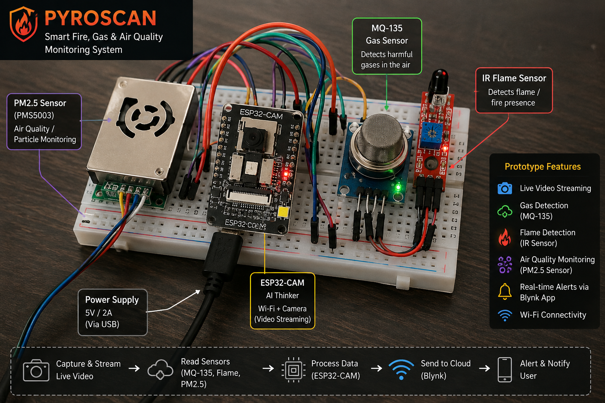
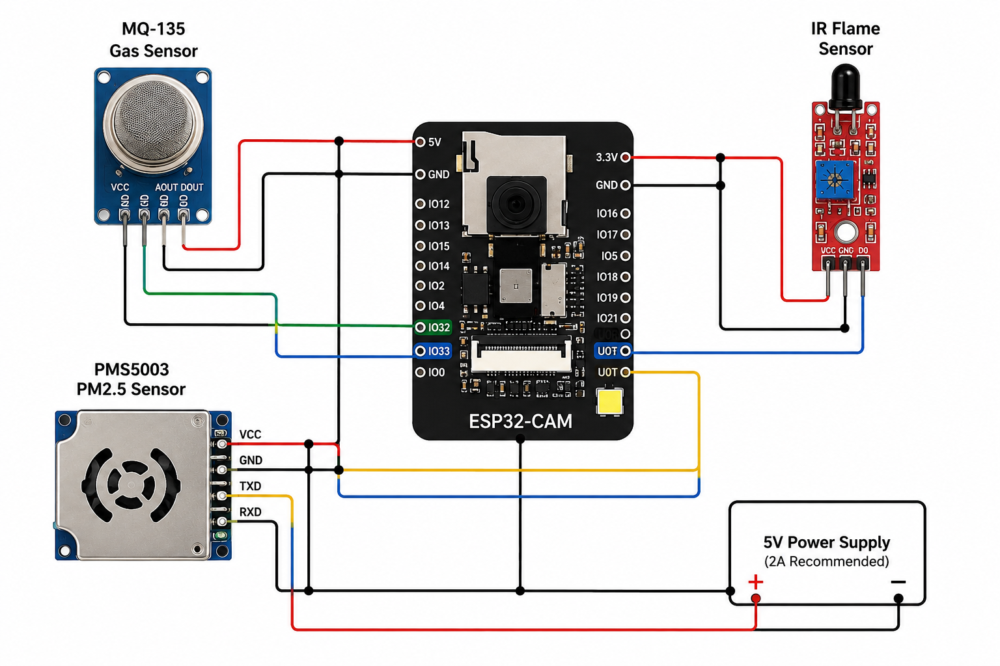
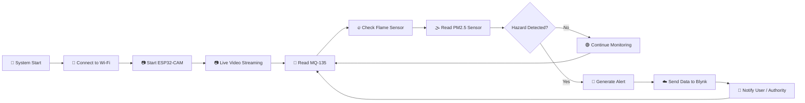
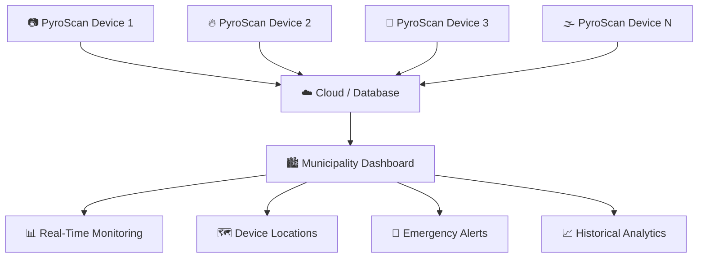

# 🔥 PyroScan — Smart Fire, Gas & Air Quality Monitoring System

<div align="center">


<br/>


<br/><br/>

### 🔥 Detect   •   👁️ Monitor   •   📡 Analyze   •   🚨 Alert

> **An intelligent IoT-based safety monitoring system combining live visual surveillance, gas detection, flame detection, PM2.5 monitoring, and real-time cloud alerts.**

</div>

---

## 🌟 Project Overview

<table>
<tr>
<td width="50%">

### 🧠 Intelligent Monitoring

PyroScan integrates an **ESP32-CAM** with multiple environmental and hazard detection sensors to continuously monitor the surrounding environment.

</td>

<td width="50%">

### 🚨 Real-Time Safety

The system detects abnormal conditions and sends information and alerts through **Wi-Fi and Blynk IoT** for remote monitoring.

</td>
</tr>
</table>

<br/>

<div align="center">

## ⚡ System Capabilities

|  📷 Visual | 🧪 Gas |  🔥 Flame |  🌫️ PM2.5  |    📡 IoT    |
| :--------: | :----: | :-------: | :---------: | :----------: |
| Live Video | MQ-135 | IR Sensor | Air Quality | Blynk Alerts |

</div>

---

# 🛠️ PyroScan Hardware Prototype

<div align="center">



<br/>


</div>

<br/>

The PyroScan prototype combines multiple sensors with the **ESP32-CAM** to create a compact and intelligent environmental hazard monitoring unit.

---

# ⚙️ Key Features

<table>
<tr>

<td align="center" width="33%">

## 📷

### Live Video Streaming

Real-time visual monitoring using the **ESP32-CAM and OV2640 camera**.

</td>

<td align="center" width="33%">

## 🧪

### Gas Detection

Continuous air and gas monitoring using the **MQ-135 sensor**.

</td>

<td align="center" width="33%">

## 🔥

### Flame Detection

Real-time flame detection using an **IR Flame Sensor**.

</td>

</tr>

<tr>

<td align="center">

## 🌫️

### PM2.5 Monitoring

Monitoring airborne particulate matter and air quality.

</td>

<td align="center">

## ☁️

### Blynk IoT

Cloud connectivity for remote monitoring and real-time alerts.

</td>

<td align="center">

## 🚨

### Smart Alerts

Automatic alerts through notifications and optional local alarms.

</td>

</tr>
</table>

---

# 🧩 Hardware Requirements

<div align="center">

| Component                        | Purpose                                  |
| -------------------------------- | ---------------------------------------- |
| 📷 **ESP32-CAM**                 | Main controller and live video streaming |
| 🧪 **MQ-135**                    | Gas and air-quality monitoring           |
| 🔥 **IR Flame Sensor**           | Flame detection                          |
| 🌫️ **PMS5003 / PM2.5 Sensor**   | Particulate matter monitoring            |
| 🔌 **FTDI Programmer**           | Uploading code to ESP32-CAM              |
| ⚡ **5V Power Supply**            | Powering the system                      |
| 🧷 **Jumper Wires**              | Hardware connections                     |
| 🍞 **Breadboard**                | Prototype connections                    |
| 🔊 **Buzzer / LED** *(Optional)* | Local alerts                             |

</div>

---

# ⚡ Circuit Diagram

<div align="center">



<br/>

### 🔌 Complete Wiring Architecture of PyroScan

</div>

---

# 🔗 Wiring Connections

## 📷 ESP32-CAM → FTDI Programmer

<table>
<tr>
<th>ESP32-CAM</th>
<th>FTDI</th>
</tr>

<tr>
<td><code>5V</code></td>
<td><code>5V</code></td>
</tr>

<tr>
<td><code>GND</code></td>
<td><code>GND</code></td>
</tr>

<tr>
<td><code>U0R</code></td>
<td><code>TX</code></td>
</tr>

<tr>
<td><code>U0T</code></td>
<td><code>RX</code></td>
</tr>

<tr>
<td><code>GPIO0</code></td>
<td><code>GND</code> — Only during upload</td>
</tr>

</table>

> ⚠️ **Important:** Remove the `GPIO0 → GND` connection after uploading the code and before normal operation.

---

## 🧪 MQ-135 Gas Sensor

<table>
<tr>
<th>MQ-135</th>
<th>ESP32-CAM</th>
</tr>

<tr>
<td>VCC</td>
<td>5V</td>
</tr>

<tr>
<td>GND</td>
<td>GND</td>
</tr>

<tr>
<td>AOUT</td>
<td>GPIO 32</td>
</tr>

</table>

---

## 🔥 IR Flame Sensor

<table>
<tr>
<th>Flame Sensor</th>
<th>ESP32-CAM</th>
</tr>

<tr>
<td>VCC</td>
<td>3.3V or 5V</td>
</tr>

<tr>
<td>GND</td>
<td>GND</td>
</tr>

<tr>
<td>D0</td>
<td>GPIO 33</td>
</tr>

</table>

---

## 🌫️ PMS5003 / PM2.5 Sensor

<table>
<tr>
<th>PM2.5 Sensor</th>
<th>ESP32-CAM</th>
</tr>

<tr>
<td>VCC</td>
<td>5V</td>
</tr>

<tr>
<td>GND</td>
<td>GND</td>
</tr>

<tr>
<td>TXD</td>
<td>U0R / Configured RX Pin</td>
</tr>

<tr>
<td>RXD</td>
<td>Configured TX Pin</td>
</tr>

</table>

> ⚠️ Ensure that the serial pins used for the PM2.5 sensor do not conflict with programming or other required ESP32-CAM functions.

---

# ☁️ Blynk IoT Setup

<div align="center">

### 📡 Connect • Monitor • Analyze • Alert

</div>

<details open>

<summary><b>① Create a Device</b></summary>

<br/>

Create a new device in **Blynk Cloud**.

</details>

<details>

<summary><b>② Copy Device Credentials</b></summary>

<br/>

You will need:

```cpp
BLYNK_TEMPLATE_ID
BLYNK_TEMPLATE_NAME
BLYNK_AUTH_TOKEN
```

</details>

<details>

<summary><b>③ Configure Dashboard Widgets</b></summary>

<br/>

Add widgets for:

* 📷 Live Video Stream
* 🧪 MQ-135 Gas Value
* 🔥 Flame Detection Status
* 🌫️ PM2.5 / Air Quality Data
* 📊 Historical Graphs
* 🚨 Notifications and Alerts

</details>

---

# 💻 Software Requirements

<table>
<tr>
<th>Software / Library</th>
<th>Purpose</th>
</tr>

<tr>
<td>🛠️ Arduino IDE</td>
<td>Programming Environment</td>
</tr>

<tr>
<td><code>esp_camera.h</code></td>
<td>ESP32-CAM Control</td>
</tr>

<tr>
<td><code>WiFi.h</code></td>
<td>Wi-Fi Connectivity</td>
</tr>

<tr>
<td><code>BlynkSimpleEsp32.h</code></td>
<td>Blynk IoT Integration</td>
</tr>

</table>

### ESP32 Board Manager URL

```text
https://raw.githubusercontent.com/espressif/arduino-esp32/gh-pages/package_esp32_index.json
```

### Recommended Board

```text
AI Thinker ESP32-CAM
```

---

# 🚀 How to Upload

<details open>

<summary><b>🔹 Step 1 — Connect the FTDI Programmer</b></summary>

Connect the FTDI programmer to the ESP32-CAM according to the wiring table.

</details>

<details>

<summary><b>🔹 Step 2 — Enter Flash Mode</b></summary>

Connect:

```text
GPIO0 → GND
```

</details>

<details>

<summary><b>🔹 Step 3 — Select Board</b></summary>

Select:

```text
AI Thinker ESP32-CAM
```

</details>

<details>

<summary><b>🔹 Step 4 — Select COM Port</b></summary>

Choose the correct serial port connected to the FTDI programmer.

</details>

<details>

<summary><b>🔹 Step 5 — Upload the Code</b></summary>

Upload the complete PyroScan code.

</details>

<details>

<summary><b>🔹 Step 6 — Exit Flash Mode</b></summary>

Disconnect:

```text
GPIO0 → GND
```

</details>

<details>

<summary><b>🔹 Step 7 — Restart the ESP32-CAM</b></summary>

Press the **RESET** button.

<br/>

<div align="center">

# 🎉 PyroScan is Ready!

</div>

</details>

---

# 🧠 How PyroScan Works

<div align="center">



</div>

---

## 🔄 Monitoring Flow

<table>
<tr>

<td align="center">📷</td>
<td align="center">➡️</td>
<td align="center">🧪</td>
<td align="center">➡️</td>
<td align="center">🔥</td>
<td align="center">➡️</td>
<td align="center">🌫️</td>
<td align="center">➡️</td>
<td align="center">☁️</td>
<td align="center">➡️</td>
<td align="center">🚨</td>

</tr>

<tr>

<td align="center">Live Video</td>
<td></td>
<td align="center">Gas Monitoring</td>
<td></td>
<td align="center">Flame Detection</td>
<td></td>
<td align="center">PM2.5 Monitoring</td>
<td></td>
<td align="center">Cloud</td>
<td></td>
<td align="center">Alerts</td>

</tr>
</table>

---

# 📊 Live Monitoring Parameters

<div align="center">

| Parameter     | Sensor / Source | Status        |
| ------------- | --------------- | ------------- |
| 📷 Live Video | ESP32-CAM       | 🟢 Active     |
| 🧪 Gas Level  | MQ-135          | 🟢 Monitoring |
| 🔥 Flame      | IR Flame Sensor | 🟢 Monitoring |
| 🌫️ PM2.5     | PMS5003         | 🟢 Monitoring |
| 📡 Network    | Wi-Fi           | 🟢 Connected  |
| ☁️ Cloud      | Blynk IoT       | 🟢 Online     |

</div>

---

# 📷 Live Video Stream

Once the ESP32-CAM connects to Wi-Fi, access the camera stream using:

```text
http://<ESP32-CAM-IP>/stream
```

Replace:

```text
<ESP32-CAM-IP>
```

with the IP address assigned to your ESP32-CAM.

---

# 🏙️ Municipality Monitoring Concept

PyroScan can be deployed across multiple municipal locations to create a centralized smart safety monitoring network.



The municipality dashboard can provide:

* 📍 Device location monitoring
* 📷 Live camera access
* 🧪 Gas level visualization
* 🔥 Flame detection alerts
* 🌫️ Air-quality monitoring
* 📊 Historical sensor analytics
* 🟢 Online / Offline device tracking
* 🚨 Critical alert management

---

# 🌍 Applications

<table>
<tr>

<td align="center" width="33%">

## 🏠

### Home Safety

Fire and gas leak monitoring.

</td>

<td align="center" width="33%">

## 🏭

### Industrial Safety

Continuous environmental and hazard monitoring.

</td>

<td align="center" width="33%">

## 🏙️

### Smart Cities

Distributed municipal safety monitoring.

</td>

</tr>

<tr>

<td align="center">

## 🏫

### Public Infrastructure

Monitoring important public buildings and areas.

</td>

<td align="center">

## 🌍

### Environmental Monitoring

PM2.5 and air-quality sensing.

</td>

<td align="center">

## 🚨

### Early Hazard Detection

Real-time alerts before hazards escalate.

</td>

</tr>
</table>

---

# 🔮 Future Improvements

<details>

<summary><b>🤖 AI-Based Fire and Smoke Detection</b></summary>

Use computer vision and machine learning to identify fire and smoke directly from the ESP32-CAM video feed.

</details>

<details>

<summary><b>💾 Event-Based Recording</b></summary>

Automatically capture images or videos when an abnormal event is detected.

</details>

<details>

<summary><b>📍 GPS Integration</b></summary>

Add location information for faster emergency response.

</details>

<details>

<summary><b>🔊 Local Emergency Alerts</b></summary>

Add sirens, buzzers, LEDs, or warning indicators.

</details>

<details>

<summary><b>🏙️ Multi-Device Municipality Network</b></summary>

Deploy multiple PyroScan units across different city locations and monitor them through a centralized command dashboard.

</details>

<details>

<summary><b>📊 Cloud Data Analytics</b></summary>

Store historical sensor data for trend analysis, prediction, and decision-making.

</details>

---

# ⚠️ Safety Notice

<div align="center">

## 🚨 IMPORTANT

</div>

> **PyroScan is designed for educational, research, demonstration, and prototyping purposes.**

This system should **not be used as a replacement for certified safety equipment**, including:

* 🚒 Fire alarm systems
* 🧪 Certified gas leak detectors
* 🏭 Industrial safety infrastructure
* 🚨 Emergency response systems

Always use certified safety equipment in critical real-world environments.

---

# 🧰 Technologies Used

<div align="center">


</div>

---

<br/>

<div align="center">


# 🔥 PYROSCAN

### **Smart Detection • Real-Time Monitoring • Instant Alerts**

<br/>


<br/><br/>

### ⭐ Built with Embedded Systems, IoT, and a Vision for Safer Communities

**If you found this project interesting, consider giving the repository a ⭐!**

<br/>

**🔥 Detect Early   •   📡 Monitor Anywhere   •   🚨 Respond Faster**

</div>
