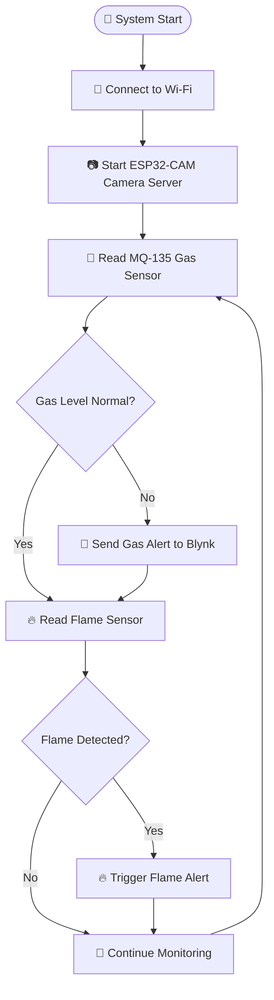

# 🔥 PyroScan — Smart Fire, Gas & Visual Monitoring System

<div align="center">


<br><br>

# 🚨 PYROSCAN

### 🔥 Detect • 👁 Monitor • 📡 Alert

**An Intelligent IoT-Based Fire, Gas & Visual Monitoring System**

<br>


</div>

---

## 🌟 Project Overview

> **PyroScan** integrates an **ESP32-CAM module** with gas and flame sensors to provide both **visual monitoring** and **environmental hazard detection**.

<table>
<tr>
<td width="50%">

### 📷 Visual Intelligence

* Live video streaming
* ESP32-CAM with OV2640
* Wi-Fi-based monitoring

</td>

<td width="50%">

### 🚨 Hazard Detection

* MQ-135 air-quality monitoring
* IR flame detection
* Real-time Blynk alerts

</td>
</tr>
</table>

The system streams **live video over Wi-Fi** and sends alerts to the **Blynk app** whenever abnormal gas levels or flame events are detected.

<br>

<div align="center">

```text
┌──────────────────────────────────────────────────┐
│                    🔥 PYROSCAN                    │
├──────────────────────────────────────────────────┤
│                                                  │
│   🧪 MQ-135 ─────┐                               │
│                  │                               │
│   🔥 Flame ──────┼──────► 🧠 ESP32-CAM          │
│                  │              │                │
│                  │              ├──► 📷 LIVE      │
│                  │              │    VIDEO        │
│                  │              │                │
│                  │              └──► 📡 Wi-Fi     │
│                  │                       │        │
│                  └───────────────────────▼        │
│                                           ☁️       │
│                                      BLYNK CLOUD  │
│                                           │       │
│                                           ▼       │
│                                      📱 ALERTS    │
└──────────────────────────────────────────────────┘
```

</div>

---

# ⚡ Features

<table>
<tr>
<td align="center" width="33%">

### 📷 Live Streaming

ESP32-CAM with OV2640 provides real-time video monitoring over Wi-Fi.

</td>

<td align="center" width="33%">

### 🧪 Gas Detection

MQ-135 continuously monitors air quality and abnormal gas levels.

</td>

<td align="center" width="33%">

### 🔥 Flame Detection

IR flame sensor detects possible flame events in real time.

</td>
</tr>

<tr>
<td align="center">

### ☁️ Blynk IoT

Cloud connectivity for monitoring and notifications.

</td>

<td align="center">

### 📡 Wi-Fi Enabled

Wireless connectivity and remote access.

</td>

<td align="center">

### 🚨 Smart Alerts

Autonomous safety alerts using notifications, sound, LEDs, etc.

</td>
</tr>
</table>

---

# 🛠 Hardware Requirements

<details open>

<summary><b>🧠 Main Controller</b></summary>

<br>

| Component    | Specification     |
| ------------ | ----------------- |
| 📷 ESP32-CAM | AI-Thinker Module |
| 📸 Camera    | OV2640            |

</details>

<details>

<summary><b>🔌 Programming & Power</b></summary>

<br>

* FTDI Programmer
* 5V Power Supply / USB
* Jumper Wires

</details>

<details>

<summary><b>🧪 Sensors</b></summary>

<br>

* 🧪 MQ-135 Gas Sensor
* 🔥 IR Flame Sensor Module

</details>

<details>

<summary><b>🔊 Optional Components</b></summary>

<br>

* Buzzer
* LED

</details>

---

# 🔌 Wiring

## 🖥 ESP32-CAM → FTDI Programmer

<table>
<tr>
<th>ESP32-CAM</th>
<th>FTDI</th>
</tr>

<tr>
<td><code>5V</code></td>
<td><code>5V</code></td>
</tr>

<tr>
<td><code>GND</code></td>
<td><code>GND</code></td>
</tr>

<tr>
<td><code>U0R</code></td>
<td><code>TX</code></td>
</tr>

<tr>
<td><code>U0T</code></td>
<td><code>RX</code></td>
</tr>

<tr>
<td><code>GPIO0</code></td>
<td><code>GND</code> ⚠️ Only during upload</td>
</tr>
</table>

> ⚠️ **Important:** Remove the `GPIO0 → GND` connection after uploading the code.

---

## 🧪 MQ-135 Gas Sensor

<table>
<tr>
<th>MQ-135</th>
<th>ESP32-CAM</th>
</tr>

<tr>
<td>VCC</td>
<td>5V</td>
</tr>

<tr>
<td>GND</td>
<td>GND</td>
</tr>

<tr>
<td>AOUT</td>
<td>GPIO 32 <i>(adjustable)</i></td>
</tr>
</table>

---

## 🔥 IR Flame Sensor

<table>
<tr>
<th>Flame Sensor</th>
<th>ESP32-CAM</th>
</tr>

<tr>
<td>VCC</td>
<td>3.3V or 5V</td>
</tr>

<tr>
<td>GND</td>
<td>GND</td>
</tr>

<tr>
<td>D0</td>
<td>GPIO 33 <i>(adjustable)</i></td>
</tr>
</table>

---

# ☁️ Blynk Setup

<div align="center">

### 📡 Connect • Monitor • Get Alerted

</div>

### ① Create a Device

Create a new device in **Blynk Cloud**.

### ② Copy Your Credentials

```cpp
BLYNK_TEMPLATE_ID
BLYNK_TEMPLATE_NAME
BLYNK_AUTH_TOKEN
```

### ③ Configure Dashboard Widgets

<table>
<tr>
<td align="center">📷<br><b>Live Video Stream</b></td>
<td align="center">📊<br><b>Gas Gauge / Graph</b></td>
<td align="center">🔴<br><b>Flame Alert</b></td>
</tr>
</table>

Add:

* 📷 Live Video Stream widget using the ESP32-CAM URL
* 📊 Gauge / Graph widgets for gas values
* 🔴 LED / Notification widget for flame alerts

---

# 💻 Software Requirements

<div align="center">

| Tool / Library          | Usage                   |
| ----------------------- | ----------------------- |
| 🛠 Arduino IDE          | Programming environment |
| 📷 `esp_camera.h`       | Camera control          |
| 📡 `WiFi.h`             | Wi-Fi connectivity      |
| ☁️ `BlynkSimpleEsp32.h` | Blynk IoT integration   |

</div>

### ESP32 Board Support

Add the following URL in Arduino IDE Board Manager settings:

```text
https://raw.githubusercontent.com/espressif/arduino-esp32/gh-pages/package_esp32_index.json
```

---

# 🚀 How to Upload

<details open>

<summary><b>🔹 Step 1 — Connect FTDI</b></summary>

Connect the FTDI programmer to the ESP32-CAM.

</details>

<details>

<summary><b>🔹 Step 2 — Enter Flash Mode</b></summary>

Connect:

```text
GPIO0 → GND
```

</details>

<details>

<summary><b>🔹 Step 3 — Select Board</b></summary>

```text
Board → AI Thinker ESP32-CAM
```

</details>

<details>

<summary><b>🔹 Step 4 — Select COM Port</b></summary>

Choose the correct serial port.

</details>

<details>

<summary><b>🔹 Step 5 — Upload the Code</b></summary>

Upload the merged project code.

</details>

<details>

<summary><b>🔹 Step 6 — Exit Flash Mode</b></summary>

Remove:

```text
GPIO0 → GND
```

</details>

<details>

<summary><b>🔹 Step 7 — Reset</b></summary>

Press the **RESET** button on the ESP32-CAM.

<br>

<div align="center">

# 🎉 SYSTEM READY!

</div>

</details>

---

# 🧠 How It Works

<div align="center">



</div>

### 🔄 System Operation

<table>
<tr>
<td width="10%" align="center">1️⃣</td>
<td>The <b>ESP32-CAM connects to Wi-Fi</b> and starts the camera server.</td>
</tr>

<tr>
<td align="center">2️⃣</td>
<td>Sensor data is continuously read inside the <code>loop()</code>.</td>
</tr>

<tr>
<td align="center">3️⃣</td>
<td>The <b>MQ-135</b> provides analog air-quality values.</td>
</tr>

<tr>
<td align="center">4️⃣</td>
<td>The <b>IR Flame Sensor</b> detects flame presence.</td>
</tr>

<tr>
<td align="center">5️⃣</td>
<td>If abnormal gas levels or flame events are detected, data is sent to <b>Blynk</b>.</td>
</tr>

<tr>
<td align="center">6️⃣</td>
<td>The system triggers a notification and optional local alerts such as a buzzer or LED.</td>
</tr>

<tr>
<td align="center">7️⃣</td>
<td>The ESP32-CAM continues providing <b>live video monitoring</b>.</td>
</tr>

</table>

---

# 📷 Live Video Stream

<div align="center">

### 🌐 Access Your Camera From Any Device on the Same Network

</div>

```text
http://<ESP32-CAM-IP>/stream
```

Replace:

```text
<ESP32-CAM-IP>
```

with the IP address assigned to your ESP32-CAM.

---

# 🌍 Applications

<table>
<tr>
<td align="center">🏠<br><b>Home Safety</b><br>Fire and gas leak monitoring</td>

<td align="center">🏭<br><b>Industrial Safety</b><br>Hazard detection systems</td>

<td align="center">🏡<br><b>Smart Homes</b><br>IoT-based automation</td>
</tr>

<tr>
<td align="center">👁️<br><b>Surveillance</b><br>Live visual monitoring</td>

<td align="center">🌍<br><b>Environment</b><br>Air-quality sensing</td>

<td align="center">🚨<br><b>Early Detection</b><br>Real-time safety alerts</td>
</tr>
</table>

---

# ⚠️ Safety Notice

<div align="center">

## 🚨 IMPORTANT

</div>

> This system is designed **only for educational, research, and prototyping purposes**.

It is **not a replacement** for certified:

* 🚒 Fire alarm systems
* 🧪 Gas leak detectors
* 🏭 Industrial safety equipment
* 🚨 Emergency response infrastructure

**Always use certified safety equipment in real-world critical environments.**

---

# 🔮 Future Improvements

<details>

<summary><b>🔊 Local Alert System</b></summary>

Add a buzzer for immediate local hazard alerts.

</details>

<details>

<summary><b>🌡 Environmental Monitoring</b></summary>

Integrate temperature and humidity sensors such as DHT22.

</details>

<details>

<summary><b>💾 Smart Event Recording</b></summary>

Add SD card recording when a hazard event is detected.

</details>

<details>

<summary><b>🤖 AI-Based Detection</b></summary>

Add machine-learning-based smoke and flame recognition.

</details>

---

<br>

<div align="center">

# 🔥 PYROSCAN

### **Smart Detection • Real-Time Monitoring • Instant Alerts**

<br>


<br><br>

### ⭐ Built with Embedded Systems, IoT, and a Passion for Safer Environments 🚀

**If you found this project interesting, consider giving the repository a ⭐!**

</div>
